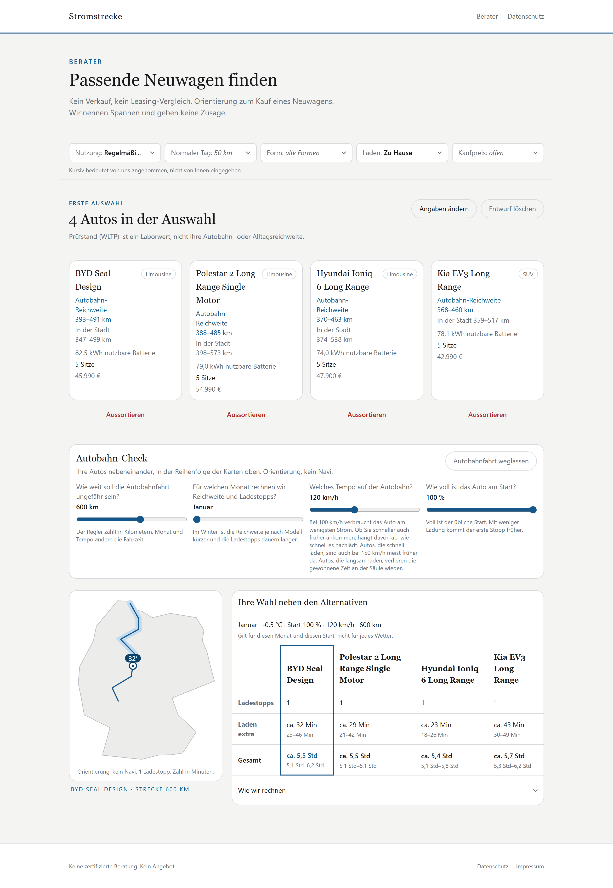
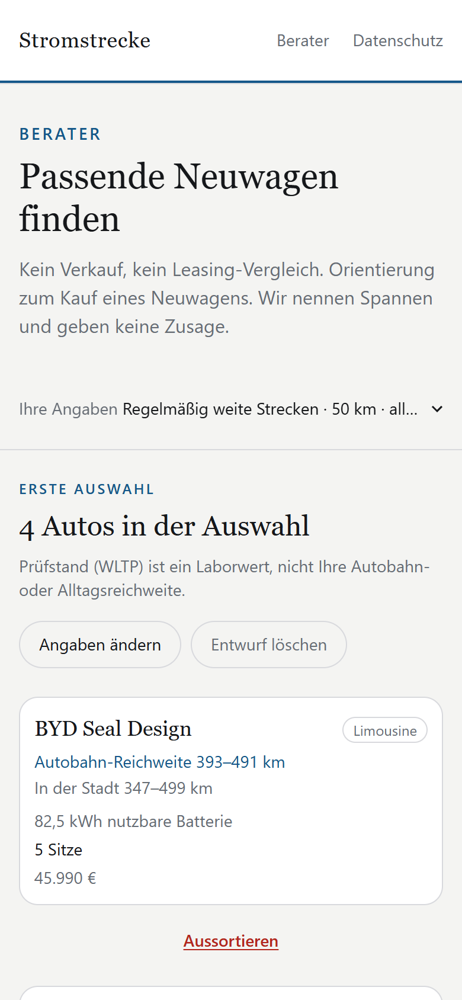

# Stromstrecke

[](https://github.com/joel1220-bmg/stromstrecke/actions/workflows/ci.yml)

**Wie weit komme ich mit einem E-Auto wirklich, und wie lange stehe ich unterwegs an der Säule?**
Stromstrecke beantwortet das für Menschen, die noch nie ein E-Auto hatten, mit ehrlichen Spannen statt Prüfstandswerten.

**Live:** [stromstrecke.de](https://stromstrecke.de)



## Worum es geht

Die größte Sorge beim Umstieg aufs E-Auto ist die Langstrecke, und genau dort führt die WLTP-Reichweite aus dem Prospekt am weitesten in die Irre. Stromstrecke fragt ein paar Dinge zum Alltag ab (Tagesstrecke, Karosserie, Lademöglichkeit, Budget) und zeigt dann für passende Neuwagen:

- **Autobahn- und Stadtreichweite als Spanne**, abhängig von Monat, Tempo und Temperatur
- **einen Autobahn-Check** für eine frei wählbare Strecke: Ladestopps auf der Karte, zusätzliche Ladezeit und Gesamtfahrzeit, nebeneinander für bis zu vier Autos
- **jede Annahme sichtbar markiert**, dort, wo man sie ändern kann. „Weiß ich nicht“ ist bei jeder Frage erlaubt.

Kein Verkauf, kein Leasing-Vergleich, kein Konto. Alles wird im Browser gerechnet, nichts verlässt ihn.

<p align="center">
  
</p>

## Wie gerechnet wird

Die Rechnung liegt in [`lib/engine`](lib/engine): reine Funktionen, ohne I/O und ohne Zufall, gleiche Eingabe gibt immer das gleiche Ergebnis.

- **Autobahnverbrauch:** Katalogwert je Auto, angepasst an das Tempo (Luftwiderstand), an die Außentemperatur (Heizung, mit oder ohne Wärmepumpe) und an die Luftdichte bei Kälte.
- **Stadtreichweite:** ausgehend vom WLTP-Wert, weil dessen Zyklus einen Stadtanteil enthält, plus Heizlast, die in der Stadt pro Kilometer stärker ins Gewicht fällt.
- **Laden:** mit der mittleren Leistung zwischen 10 und 80 Prozent statt der Spitzenleistung aus dem Datenblatt, mit Temperaturfaktor. Geladen wird nur, was die Reststrecke braucht.
- **Spannen statt Punktwerte:** Jede Zahl hat einen vorsichtigen und einen guten Fall. Lässt sich eine Grenze nicht begründen, wird die Spanne breiter, nicht schmaler.

Die Fahrzeugdaten sind Orientierungswerte für 61 aktuelle Modelle. Einträge, die noch nicht gegen eine Herstellerquelle geprüft sind, sind in [`data/cars.de.json`](data/cars.de.json) als `UNVERIFIED` markiert.

## Technik

| | |
|---|---|
| Framework | Next.js 16 (App Router) als statischer Export, React 19, TypeScript |
| Styling | Tailwind CSS 4, Systemschriften, Karte und Illustration als Inline-SVG |
| Validierung | Zod für gespeicherte Entwürfe |
| Tests | Vitest, über 160 Tests für Rechenmodell, Grenzfälle, Speicherung und Konfiguration |
| CI | GitHub Actions: Typprüfung, Tests, Lint und Build bei jedem Push |
| Hosting | lima-city, Apache mit `.htaccess` für Sicherheits-Header und Caching |

**Datenschutz und Sicherheit:** keine Tracker, keine externen Ressourcen, strenge Content-Security-Policy (`connect-src 'self'`). Der Entwurf wird nur mit ausdrücklichem Haken im `localStorage` gespeichert.

## Projektstruktur

```
app/                 Seiten: Start, Berater, Impressum, Datenschutz
components/advisor/  Fragebogen, Kontrollleiste, Ergebnis
components/showroom/ Deutschlandkarte, Illustration, Karosserie-Icons
components/ui/       wiederverwendbare Bausteine
lib/engine/          das Rechenmodell, rein und getestet
lib/copy.ts          alle Texte der Oberfläche an einer Stelle
data/                Fahrzeuge, Monatstemperaturen, Autobahnroute
docs/                Text- und Lade-Vorgaben, Backlog, Screenshots
```

## Lokal starten

```bash
npm install
npx next dev -p 3001     # http://localhost:3001
```

Prüfen wie in der CI:

```bash
npx next typegen && npx tsc --noEmit && npx vitest run && npx eslint . && npx next build
```

## Veröffentlichen

`npm run build` schreibt einen statischen Export nach `out/`. Unter Windows korrigiert ein Nachlauf-Schritt dabei einen Namensfehler im Export von Next (`scripts/flatten-export-segments.mjs`); ein bloßes `npx next build` lässt ihn aus. Dessen **Inhalt** kommt ins Web-Verzeichnis bei lima-city, auch die versteckte Datei `.htaccess`: Sie setzt die Sicherheits-Header, leitet `www.` auf die Domain ohne `www.` um und regelt das Caching. Am sichersten in einen neuen, leeren Ordner hochladen, dort entpacken und dann unter „Webseiten → Inhalt ändern“ die Domain darauf umstellen; der vorige Ordner bleibt als Rückfall. Danach `/impressum/` und `/datenschutz/` live kontrollieren.

Name und Anschrift für Impressum und Datenschutz stehen bewusst nicht im Repository, sondern in `.env.local` (von Git ignoriert):

```
IMPRESSUM_NAME=…
IMPRESSUM_STRASSE=…
IMPRESSUM_ORT=…
IMPRESSUM_EMAIL=…
```

Fehlt eine Angabe, bricht der Build ab, statt eine Seite mit Platzhalter-Impressum zu erzeugen. Nur in der CI baut er mit Platzhaltern durch, dort wird nichts veröffentlicht.

## Arbeitsweise

Das Projekt ist mit KI-Unterstützung entstanden, mit [Claude Code](https://claude.com/claude-code). Die Arbeit ist auf spezialisierte Agenten mit festen Dateibereichen aufgeteilt ([`.claude/agents/`](.claude/agents)), Regeln und bekannte Stolperfallen stehen in [`CLAUDE.md`](CLAUDE.md). Viele Commits sind deshalb als „Claude“ signiert.

Bis zum 13.09.2026 hieß das Projekt „Fahrklar“. Nur die Schlüssel im `localStorage` tragen den alten Namen noch, damit gemerkte Angaben erhalten bleiben.
